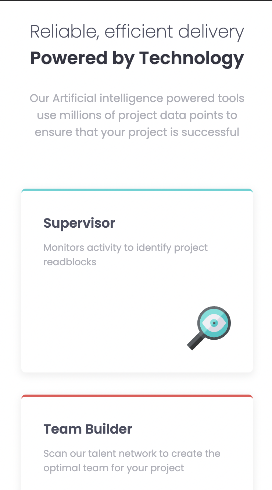
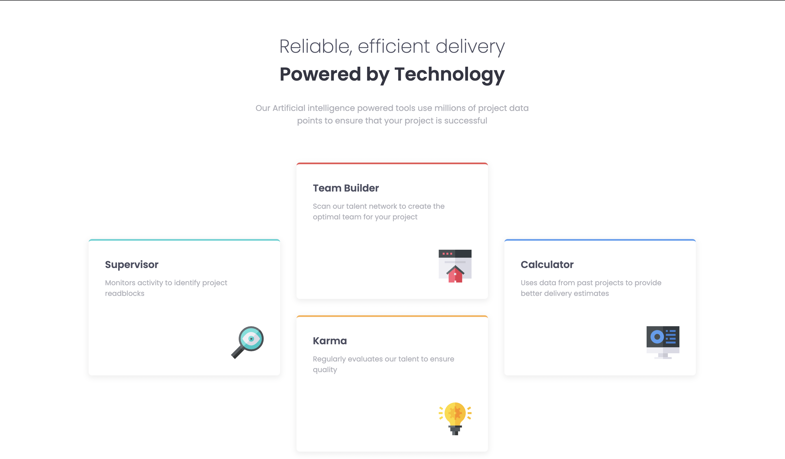

# Frontend Mentor - Four card feature section master

---

## Table of Content

* [Useful Links](#useful-links)
* [Mobile version](#mobile)
* [Desktop version](#desktop)

---

### Useful Links 

* [FM - Four card feature section master](https://www.frontendmentor.io/challenges/four-card-feature-section-weK1eFYK)

* [Vercel: My Solution](https://fm-07-four-card-feature-section.vercel.app/)

--- 
### Mobile version 

--- 
### Desktop version 

